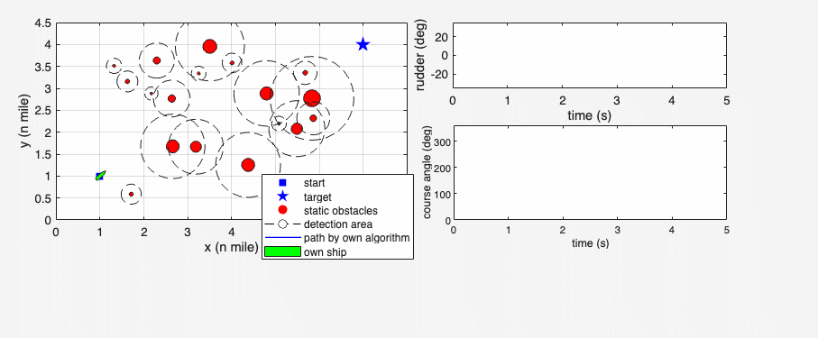

# Case 1: MPAPF Demo

This repository demonstrates **Case 1** of the **Modified Potential Artificial Potential Field (MPAPF)** algorithm for autonomous ship navigation and collision avoidance.

The implementation is designed for research and testing of ship collision avoidance strategies, trajectory planning, and scenario-based evaluation under **COLREGs** rules.

---

## Features

- ⚓ **Ship Movement Simulation** – Simulate ship dynamics and heading control using MPAPF.
- 🛑 **Obstacle Avoidance** – Static and dynamic obstacle avoidance with safety domain evaluation.
- 🧭 **COLREGs Compliance** – Decision-making following maritime navigation rules (head-on, crossing, give-way/stand-on).
- ⚙️ **Scenario Configurability** – Easily modify initial positions, end points, obstacle positions, and ship parameters.
- 🎨 **Visualization** – Generate 2D plots and GIFs for trajectory demonstration.

---

## Usage

1. **Install dependencies**\
   MATLAB R2021a or later is required. Optional toolboxes: Optimization Toolbox, Global Optimization Toolbox.
2. **Run the demo script**
   ```matlab
   case1_1.m
   ```
3. **View results**\
   The simulation produces a demonstration GIF:
   ```
   case1_demo.gif
   ```
4. **Modify scenarios**\
   Adjust `start_point`, `end_point`, `static_obs_area`, `dynamic_ships`, and ship parameters in the configuration section of the script to explore different encounter cases.

---

## Demo
<p align="center">
  
</p>


---

## File Structure

```
MPAPF/
├─ README.md
├─ case1_1.m                 # Main demo script
├─ Copy_of_test4potential.m  # Potential field computation
├─ shipdynamic.m             # Ship dynamics model
├─ iscollisionavoidacne.m    # Collision avoidance check
├─ COLREGS_situation.m       # COLREGs rules logic
├─ PSO_MPC_Cost_Function.m   # PSO-based MPC cost function
├─ MPC_Cost_Function_Targetship.m # Target ship cost function
├─ shipDisplay3.m            # Ship display function
├─ domaindisplay.m           # Obstacle and ship domain display
├─ DCPA_TCPA.m               # DCPA & TCPA calculation
└─ case1_demo.gif         # Generated trajectory GIF
```

---

## Dependencies

- MATLAB R2021a or later
- Optimization Toolbox (for `fmincon`)
- Global Optimization Toolbox (for `particleswarm`)

---

## Citation

If you use this project in your research, please cite:

```bibtex
@article{he2023novel,
  title={A novel model predictive artificial potential field based ship motion planning method considering COLREGs for complex encounter scenarios},
  author={He, Zhibo and Chu, Xiumin and Liu, Chenguang and Wu, Wenxiang},
  journal={ISA transactions},
  volume={134},
  pages={58--73},
  year={2023},
  publisher={Elsevier}
}
```

---

## Acknowledgements

This project uses parts of [MSS](https://github.com/cybergalactic/MSS) for ship modeling and simulation utilities.

---

## License

This project is licensed under the **MIT License**.

